# Overview

<a class="gallery" href="images/word-clock-hanging-on.jpg" title="The finished word clock.">
  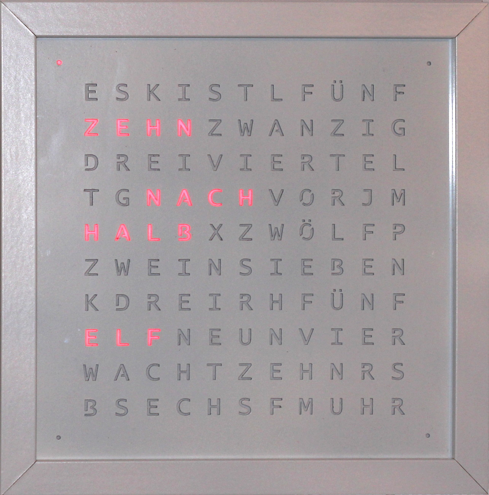
</a>

These are the design files for a word clock (see
[mikrocontroller.net](http://www.mikrocontroller.net/articles/Word_Clock)). It
uses a 20x20 cm² single layer PCB which is meant to be built into a small
23x23 cm² RIBBA picture frame from IKEA.

# PCB

<a class="gallery" href="images/board.jpg" title="Rendering of the PCB.">
  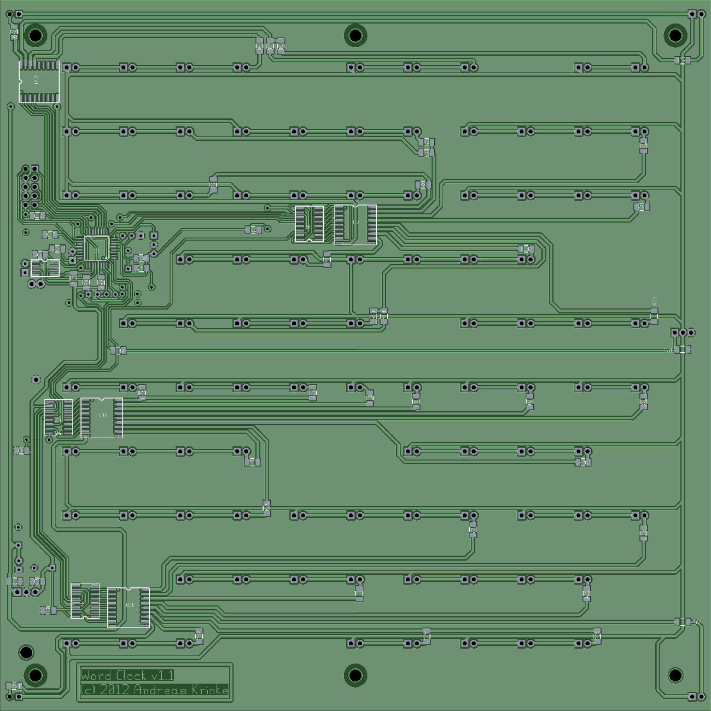
</a>
<a class="gallery" href="images/pcb-top.jpg" title="Top side of the PCB with all the LEDs.">
  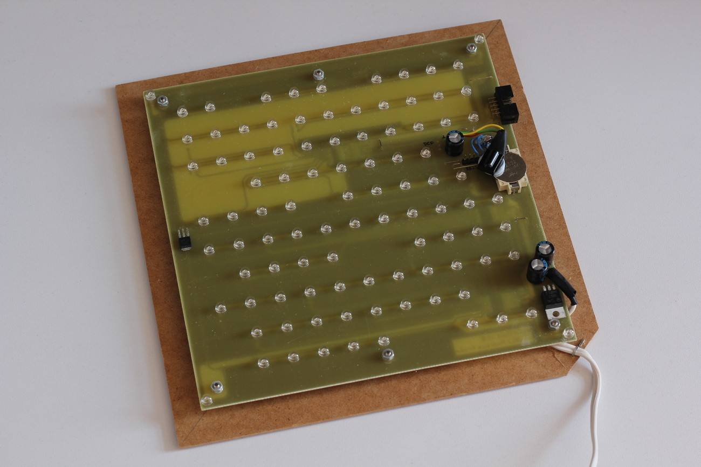
</a>
<a class="gallery" href="images/pcb-bottom.jpg" title="Bottom side of the PCB with the copper tracks and all SMD components.">
  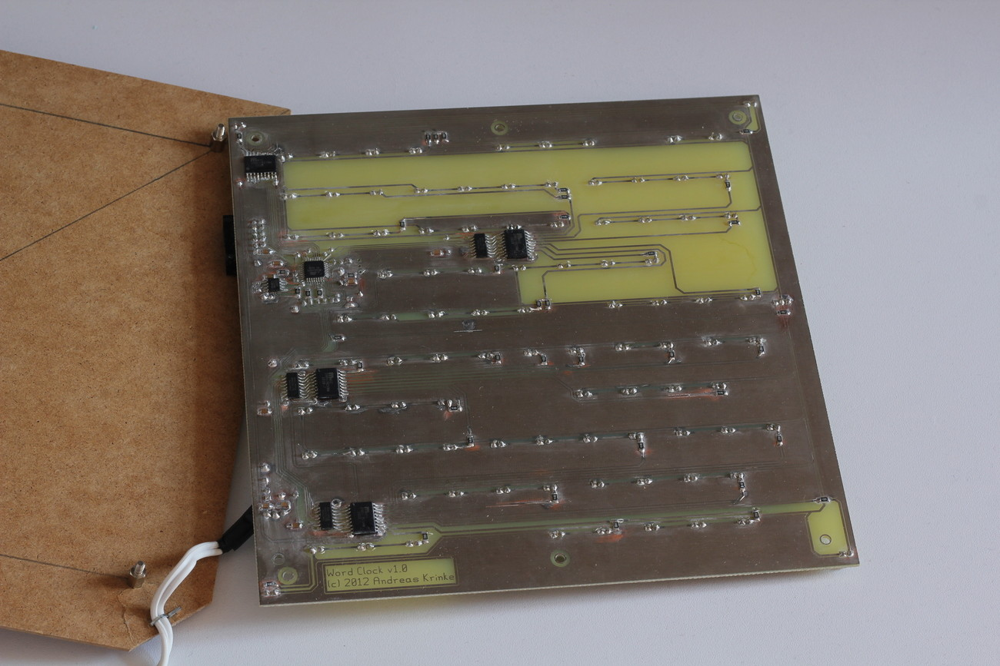
</a>
The single layer PCB was created using [gEDA](http://www.geda-project.org)
(gschem and pcb). It's based on the schematic from mikrocontroller.net (variant
1,
[sheet 1](https://raw.github.com/akrinke/small-ribba-wordclock/master/pcb/schematic-1.pdf),
[sheet 2](https://raw.github.com/akrinke/small-ribba-wordclock/master/pcb/schematic-2.pdf))
with small changes to the pin assignment in order to simplify the layout.
Because the PCB has only a single layer, it can be produced at a low cost. I
ordered mine from [platinenbelichter.de](http://platinenbelichter.de) for less
than 30 EUR.

# Parts

## LEDs

You need 97 LEDs (through hole, not SMD). I bought a pack of 100 straw hat leds
from eBay.

## LED Series Resistors

Depending on the lengths of the words on the front panel, there are groups of
one, two, three, or four LEDs for each word. Each group needs one series
resistor whose value depends on the number of LEDs in the group, the supply
voltage, the LED current, and the LED forward voltage. In my case, the voltage
across each group is 10.6 V (12 V wall power supply minus 1.4 V voltage drop
across the MIC2981 driver). For my LEDs, I simply experimented with different
resistor values for 1,2,3,4 LEDs in series until the current matched 20 mA.

## Complete Part List

See
[part-list.ods](https://raw.github.com/akrinke/small-ribba-wordclock/master/part-list.ods),
for a complete part list.  In Germany, you can order all parts from
[Bürklin](http://www.buerklin.com), [Reichelt](http://www.reichelt.de) and
eBay---see list for part numbers.

# Firmware

The original software from mikrocontroller.net was modified to comply with the
schematic and pcb layout changes but was not altered otherwise.

# Letter Stencil

<a class="gallery" href="images/letter-stencil.jpg" title="The letter stencil: 1.5 mm MDF, laser cut, many layers of acryl spray paint.">
  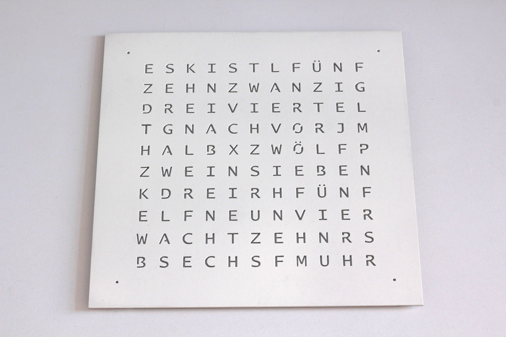
</a>
The word clock requires a letter stencil in front of the LEDs. A laser cutting
template for a german version of the stencil is included.  I used 1.5mm thick
MDF (bought from [Gerstaecker](http://www.gerstaecker.de)). Note: Painting MDF
requires many passes with intermediate sanding! Be patient.

# Light Guide

<a class="gallery" href="images/light-guide.jpg" title="Light guide made from laser cut black paper.">
  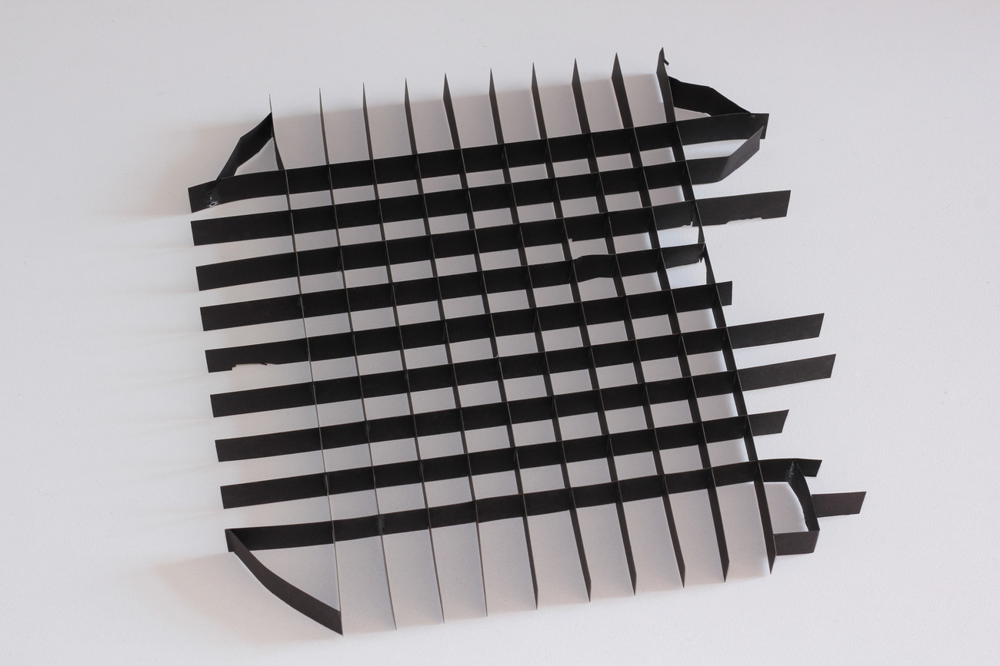
</a>
The LEDs must not light up neighboring letters. Therefore, we need some kind of
guide to block their light. The files for a laser cut paper light guide are
included. Depending on the thickness of the material you might have to
regenerate the template from the source SVG.
I used black paper for my laser cut light guide. Because of the components on the
PCB, several cut-outs were required.

# Assembly

<a class="gallery" href="images/back-panel.jpg" title="Back panel of the RIBBA picture frame with 8 mm standoff spacers.">
  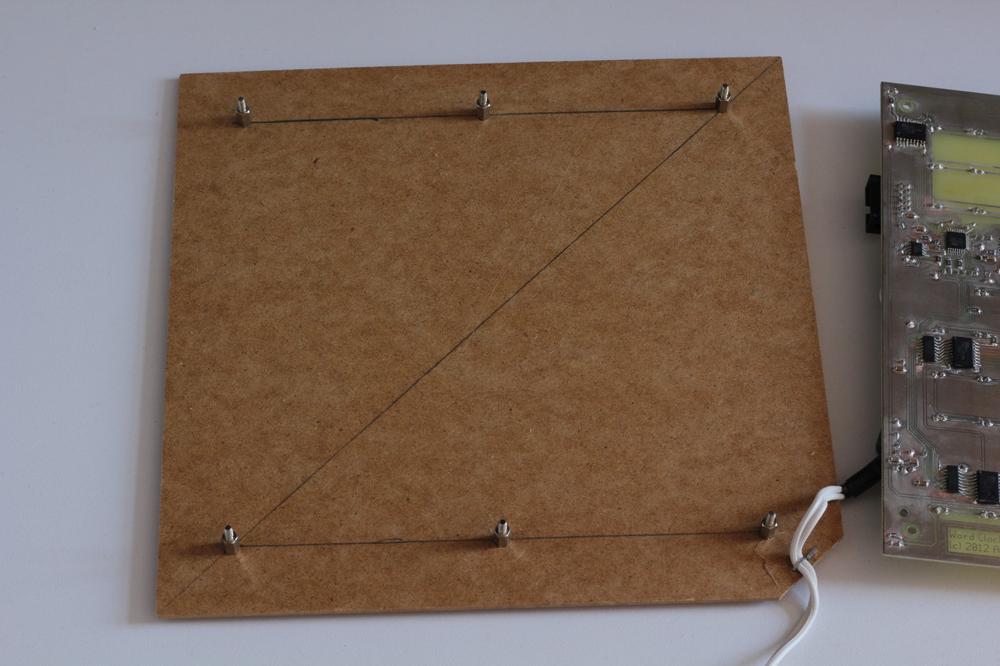
</a>

<a class="gallery" href="images/light-guide-pcb-off.jpg" title="Light guide assembled and positioned on top of PCB.">
  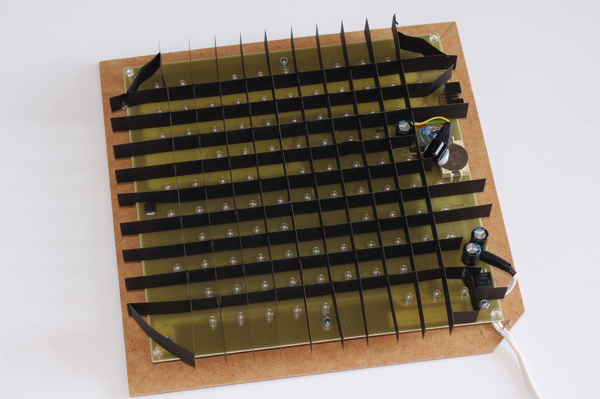
</a>
<a class="gallery" href="images/light-guide-pcb-on.jpg" title="Word clock switched on.">
  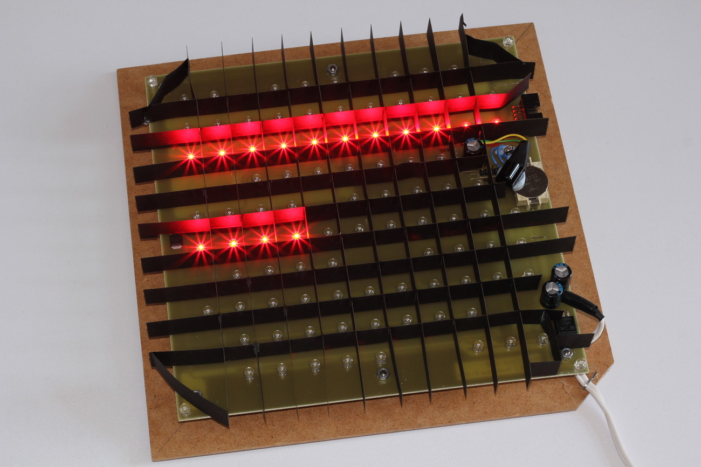
</a>
<a class="gallery" href="images/letter-stencil-pcb.jpg" title="Letter stencil added.">
  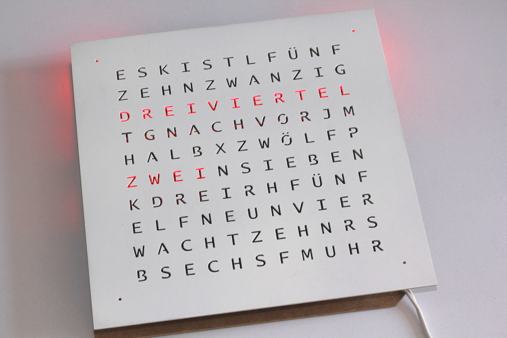
</a>
<a class="gallery" href="images/word-clock-off.jpg" title="Finished word clock.">
  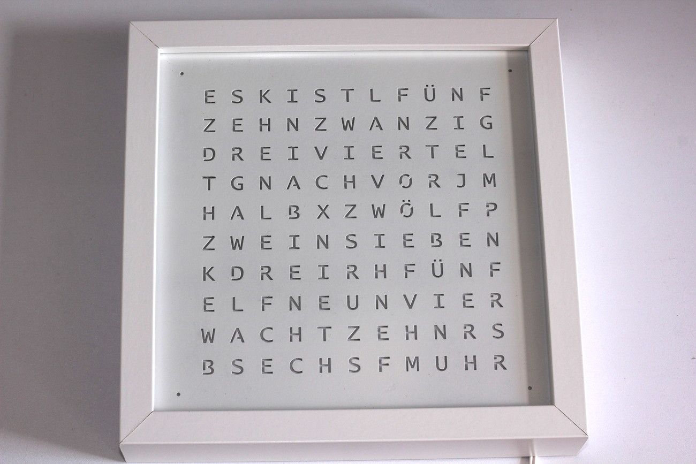
</a>
<a class="gallery" href="images/word-clock-on.jpg" title="Finished word clock switched on.">
  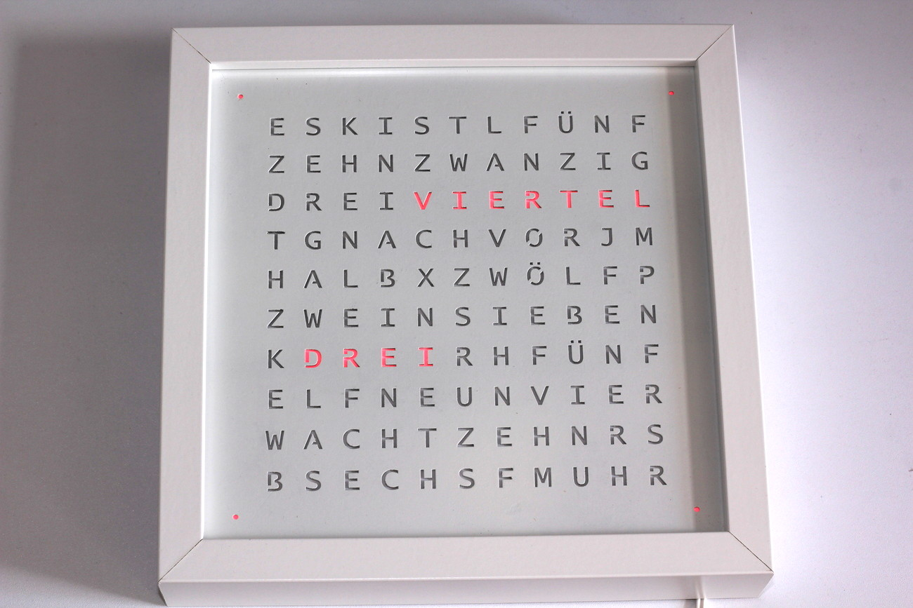
</a>

